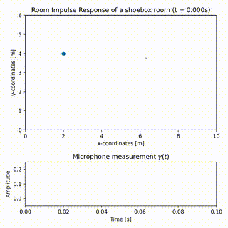
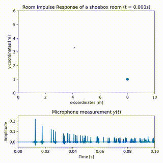

# Visualizing RIR propagation between a source and receiver using Image Source Method

This repository contains a Python script that visualizes the propagation of the RIR between a source and receiver positioned in a 2D room. The animation is created using the Image Source Method (ISM) implemented in Pyroomacoustics.


## Examples





## Installation

The script requires Python 3.6 or higher. The required packages can be
installed using the following command:

```bash
pip install -r requirements.txt
```

## Usage

The script can be run using the following command:

```bash
python ism_animation.py
```

## Thanks

(Heavily) inspired by Randall Ali's animation. 🙏
